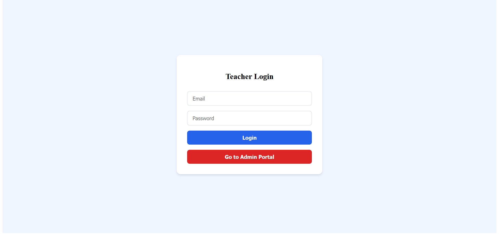
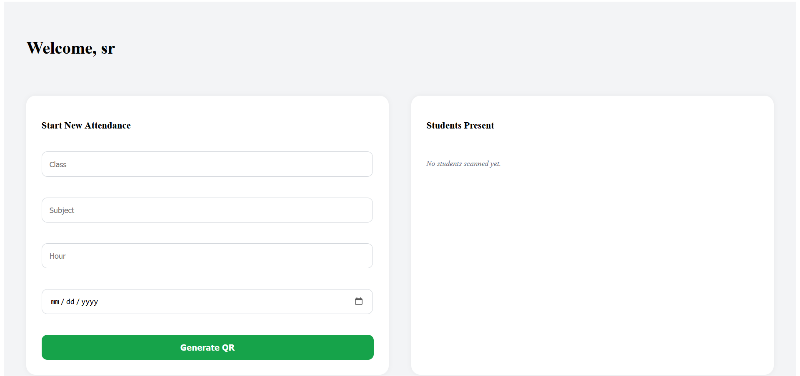
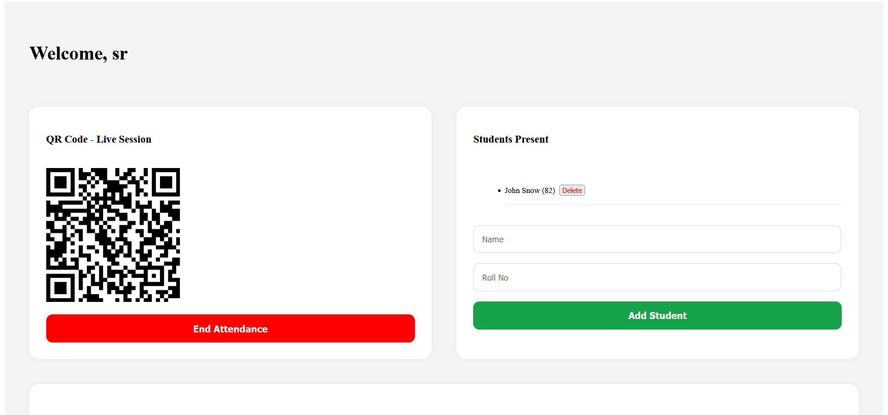
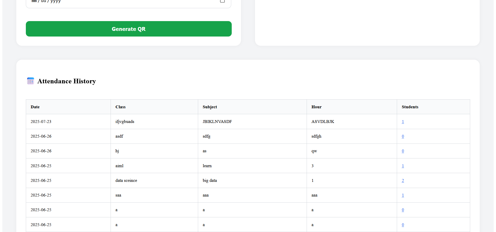
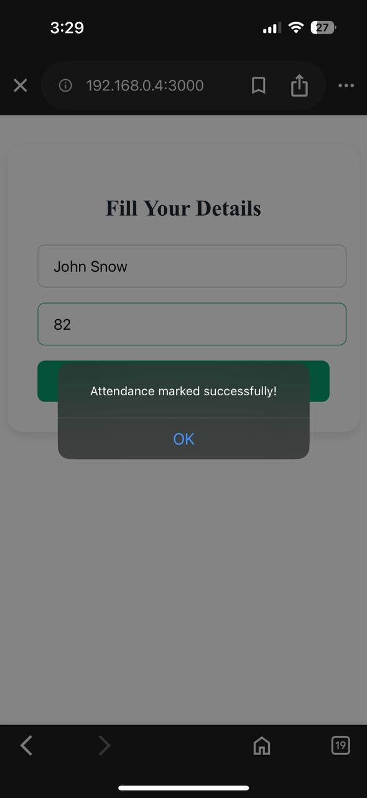
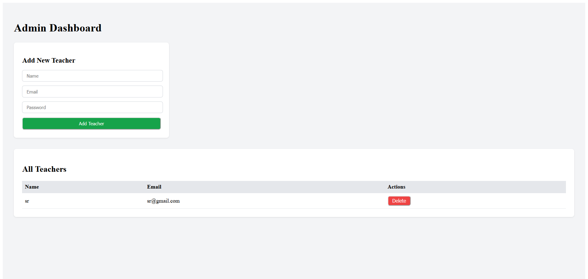

# QR-Based Smart Attendance System

A full-stack web application that allows teachers to take attendance using **QR codes**, view live student responses, and manage sessions. Admins can manage teachers, and students can mark attendance using scanned QR codes.

---

## ✨ Features

### 🧑‍🏫 Teacher Dashboard

* Start session and generate QR code
* View live student attendance
* Add or delete students manually
* View attendance history
* End ongoing session

### 👨‍🏫 Student Portal

* Scan QR code
* Submit attendance with name & roll no
* Single-device attendance prevention

### 🛡️ Admin Dashboard

* Add/Delete teachers
* View all registered teachers

---

## 🛠️ Tech Stack

| Layer    | Technology                       |
| -------- | -------------------------------- |
| Frontend | React, Tailwind CSS / Custom CSS |
| Backend  | Node.js, Express.js              |
| Database | MongoDB (Mongoose ODM)           |
| QR Code  | qrcode.react                     |
| Auth     | JWT (for teacher & admin login)  |

---

## 📦 Dependencies (Install via `npm install`)

### Frontend (in `/client`):

```bash
npm install axios react-router-dom qrcode.react
```

### Backend (in `/server`):

```bash
npm install express mongoose cors jsonwebtoken bcryptjs dotenv
```

---

## 🚀 How to Run the Project

### 1. Clone the Repository

```bash
git clone https://github.com/sairam030/QR-Attendance.git
cd qr-attendance-app
```

### 2. Start Backend

```bash
cd server
npm install
node server.js
```

* Runs on: `http://localhost:5000`

### 3. Start Frontend

```bash
cd client
npm install
npm start
```

* Runs on: `http://localhost:3000`

---

## 📅 Folder Structure

```
qr-attendance-app/
├── client/               # React frontend
│   ├── components/       # TeacherDashboard, AdminLogin, etc.
│   ├── App.js
│   └── ...
├── server/               # Node.js backend
│   ├── models/
│   ├── routes/
│   ├── controllers/
│   └── server.js
├── README.md
└── .env
```

---

## 📸 Screenshots

> Add screenshots in a folder `/screenshots` or upload and link via Imgur/GitHub.

#### 👨‍🏫 Teacher Login



#### 🧑‍🏫 Teacher Dashboard



#### 🧑‍🏫 Teacher Dashboard



#### 📅 Attendance History



#### 👨‍🏫 Student QR Attendance



#### 🛡️ Admin Dashboard



---

## ✅ To-Do / Future Features

* ✅ Network IP restriction for proxy prevention
* ✅ Single-device marking per session
* ⏳ Export attendance to Excel
* ⏳ OTP or face recognition-based login
* ⏳ Student attendance analytics

---

## 👤 Author

**Sai Ram S.A.**
Feel free to contribute to this repo by creating a pull request.

---
